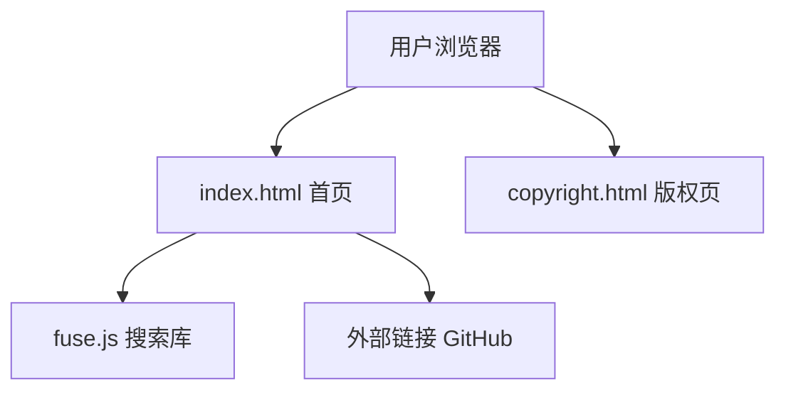

# GitHub Skill 集成静态站 - 技术架构文档

## 1. Architecture Design
本项目为纯静态网站，采用原生HTML5 + CSS3 + JavaScript技术栈，无后端和数据库依赖。



## 2. Technology Description
- 前端：原生HTML5 + CSS3 + JavaScript (ES6+)
- 搜索库：fuse.js (CDN引入)
- 部署：GitHub Pages / Vercel / Cloudflare Pages
- 架构：纯静态，单文件为主结构

## 3. Route Definitions
| Route | Purpose |
|-------|---------|
| /index.html | 首页，包含所有功能和内容 |
| /copyright.html | 版权声明页 |

## 4. API Definitions (if backend exists)
不适用，无后端API

## 5. Server Architecture Diagram (if backend exists)
不适用，无后端

## 6. Data Model (if applicable)
前端数据结构，用于Skill数据存储和搜索：

### 6.1 Data Model Definition
```javascript
const skillList = [
  {
    id: string,
    name: string,
    author: string,
    category: string,
    description: string,
    githubUrl: string,
    license: string
  }
];
```

### 6.2 Data Definition Language
不适用，无数据库
