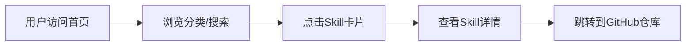

# GitHub Skill 集成静态站 - 产品需求文档

## 1. Product Overview
GitHub Skill 集成静态站是一个聚合GitHub开源AI Skill/工具的纯静态导航站，面向零基础新手、个人开发者、静态站运营者，提供分类导航、信息展示与官方仓库直达服务。
- 核心目标：零门槛开发、零成本部署、合规可变现，通过广告获取收益
- 核心约束：Skill资源100%来源于GitHub公开开源仓库，全程合规规避版权与法律风险

## 2. Core Features

### 2.1 User Roles (if applicable)
无用户角色区分，所有访问者都是普通用户，无需注册登录即可浏览所有功能。

### 2.2 Feature Module
1. **首页**：顶部导航栏、搜索框、热门Skill展示、分类导航卡片、页脚版权信息
2. **版权声明页**：完整版权归属、第三方资源免责、侵权处理规则

### 2.3 Page Details
| Page Name | Module Name | Feature description |
|-----------|-------------|---------------------|
| 首页 | 顶部导航栏 | 显示网站Logo、主导航链接（首页、分类、版权声明） |
| 首页 | 搜索功能 | 纯前端本地搜索，支持搜索Skill名称、简介、分类、作者 |
| 首页 | 热门Skill轮播/展示 | 展示精选热门GitHub Skill |
| 首页 | 分类卡片展示区 | 6个核心分类：文案写作、AI绘画、职场办公、学习备考、代码开发、生活实用，每个分类下展示多个Skill卡片 |
| 首页 | Skill卡片 | 每个卡片包含：Skill名称、原创一句话简介、原作者GitHub名称、开源协议类型、GitHub仓库直达按钮 |
| 首页 | 预留广告位 | 顶部横幅、分类间信息流、底部横幅广告位 |
| 首页 | 页脚 | 版权声明、侵权投诉邮箱、版权声明页链接、返回顶部按钮 |
| 版权声明页 | 版权内容 | 完整的版权归属、第三方资源免责、侵权处理规则 |

## 3. Core Process
用户访问首页 → 浏览分类或使用搜索功能 → 点击感兴趣的Skill卡片 → 点击"GitHub仓库直达"跳转到原仓库 → 用户继续使用或返回本站浏览其他Skill

## 4. User Interface Design
### 4.1 Design Style
- 主色调：深蓝色 (#1e3a5f) 搭配 浅蓝色 (#2563eb)，科技感强且不刺眼
- 辅助色：浅灰色背景 (#f8fafc)，卡片白色 (#ffffff)，边框浅灰 (#e2e8f0)
- 按钮样式：圆角矩形 (8px)，悬停效果平滑过渡
- 字体：系统字体栈，标题稍粗，正文清晰易读
- 布局风格：卡片式布局，顶部导航，响应式设计
- 整体风格：极简科技风，清爽简洁，加载速度快

### 4.2 Page Design Overview
| Page Name | Module Name | UI Elements |
|-----------|-------------|-------------|
| 首页 | 顶部导航栏 | 固定顶部，深色背景，白色文字，Logo+导航链接 |
| 首页 | 搜索区域 | 大型搜索框，居中布局，占位符提示文字 |
| 首页 | Skill分类区 | 网格布局，每分类下展示8个卡片，卡片悬停有阴影和上移效果 |
| 首页 | Skill卡片 | 白色背景，浅灰色边框，底部按钮蓝色背景 |
| 首页 | 广告位 | 虚线边框，灰色提示文字，清晰标注广告位 |
| 版权声明页 | 内容区 | 白色背景，标题加粗，段落清晰，行高适中 |

### 4.3 Responsiveness
- 桌面端优先，移动端自适应
- 卡片布局：桌面端4列，平板端3列，移动端1-2列
- 触摸优化：按钮和可点击区域足够大，适合触摸操作
- 适配设备：手机、平板、笔记本、桌面电脑

### 4.4 3D Scene Guidance (if applicable)
不适用，本项目为纯静态导航站，无需3D效果
